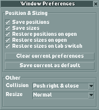

# Permanently organize windows in OpenRCT2

This plugin saves the positions and resizing of windows and restores them when
a window is re-launched or its tab is switched. No more confusing new window
locations, no more dragging your mouse to the ends of the earth just to adjust
the clear scenery tool, no more constantly re-adjusting sizes and dragging
windows back around to where you want them! They just stay where you want them
even after closing them!

## How to use

As you play drag windows to your preferred spots.
I recommend to drag mutually-exclusive tool windows (Path, Clear Scenery, Place
Scenery, Dig, Water, etc.) to a spot left of center to minimize mouse movement
while still seeing what your are doing.

Drag other window types where-ever you see fit.
Some types of windows such as Peep, Staff, and Ride view support multiples on
screen at once. I recommend placing such windows closer to the left so that new
windows can push existing windows to the right. The default collision handler
avoids overlapping windows by pushing existing windows right and closing them if
they would fall off the edge of the screen.

Once you are satisified with our window locations and sizes in a session be sure
to click the "Save current as default" button to save your window preferences
for the next time OpenRCT2 is launched. You may also prevent further automatic
changes to your preferences in a session by unchecking the "Save positions" and
"Save sizes" checkboxes.

There are experimental resizing options:
"Force no shrink" will attempt to prevent some window types from downsizing
when changing tabs. This can result in an awkward amount of dead visual space.
"Force max to screen" will attempt to make most window types resizable to the
entire size of the screen. Both of these options can sometimes result in visual
glitches, especially the latter.

## Install

To install just place `window-preferences.js` in your OpenRCT2 plugin folder:

| Platform | Plugin folder location                           |
|----------|--------------------------------------------------|
| Windows  | `%APPDATA%\OpenRCT2\plugin\`                     |
| Mac      | `~/Library/Application Support/OpenRCT2/plugin/` |
| Linux    | `~/.config/OpenRCT2/plugin/`                     |

## Limitations

Original window locations may flash briefly on screen.
The OpenRCT2 plugin API does not have a direct hook for window placement changes
before they reach the screen. Instead this plugin attempts to detect changes
on a fixed short interval. So brief flashes of original positions and sizes are
to be expected.

The scenery picker window is completely avoided in terms of resizing.
That window in particular constantly resets its max sizing for its cursor
dependent drawer functionality. I personally find this behavior really annoying,
but I have not found a way to mitigate it within the plugin API.

Some types of windows fight the forced resizing or make the resize widget
unavailable. There could be improvements made in the form of window specific
hacks to address these problems.
